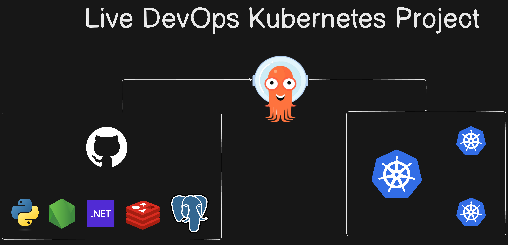
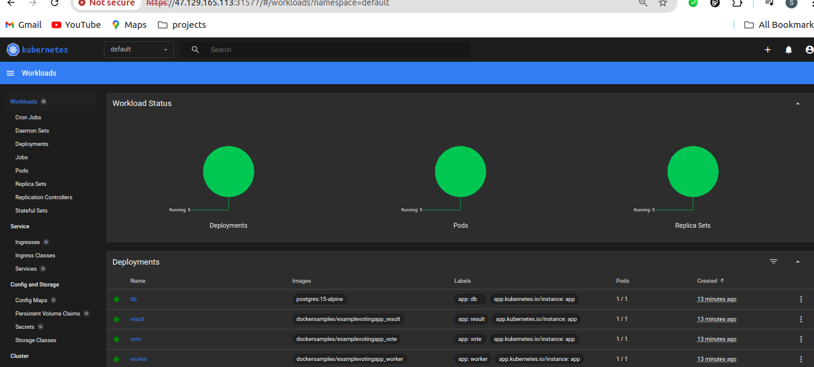
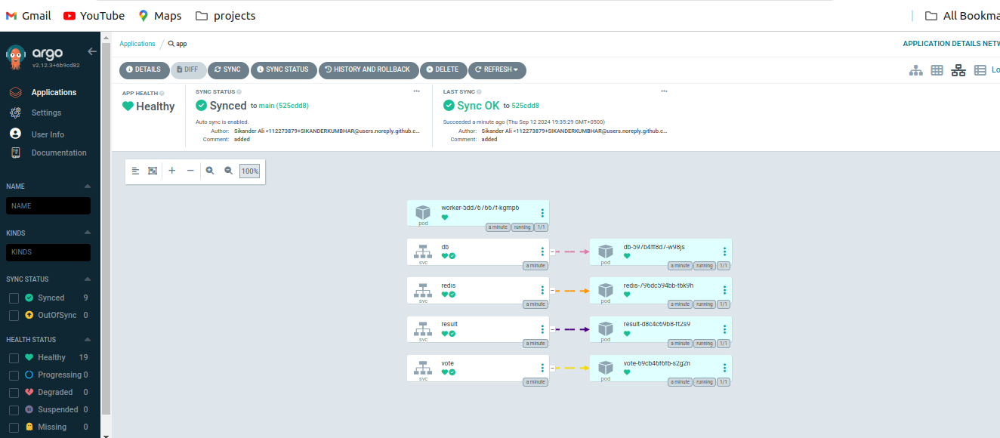

# GitOps Project: Automated Application Deployment on Kubernetes with GitHub and Argo CD
**K8s Kind Voting App**

A comprehensive guide for setting up a Kubernetes cluster using Kind on an AWS EC2 instance, installing and configuring Argo CD, and deploying applications using Argo CD.

## Overview

This guide covers the steps to:
- Launch an AWS EC2 instance.
- Install Docker and Kind.
- Create a Kubernetes cluster using Kind.
- Install and access kubectl.
- Set up the Kubernetes Dashboard.
- Install and configure Argo CD.
- Connect and manage your Kubernetes cluster with Argo CD.
  
## Architecture



* A front-end web app in [Python](/vote) that lets users vote between two options.
* A [Redis](https://hub.docker.com/_/redis/) container to collect new votes.
* A [.NET](/worker/) worker service to process votes and store them in…
* A [Postgres](https://hub.docker.com/_/postgres/) database backed by a Docker volume.
* A [Node.js](/result) web app to display real-time voting results.

## Steps to Setup

### 1. Launch an AWS EC2 Instance

- Create an EC2 instance with the desired specifications (t2.micro or larger).
- Install Docker:
  ```bash
  sudo apt-get update
  sudo apt install docker.io
  ```
- Add your user to the Docker group to avoid using `sudo`:
  ```bash
  sudo usermod -aG docker $USER
  ```

### 2. Install Kind and Create a Kubernetes Cluster

- Install Kind (Kubernetes in Docker):
  ```bash
  curl -Lo ./kind https://kind.sigs.k8s.io/dl/v0.11.1/kind-linux-amd64
  chmod +x ./kind
  sudo mv ./kind /usr/local/bin/kind
  ```

- Create a Kubernetes cluster using Kind:
  ```bash
  kind create cluster
  ```

### 3. Install kubectl

- Install kubectl to interact with the Kubernetes cluster:
  ```bash
  curl -LO "https://dl.k8s.io/release/$(curl -s https://storage.googleapis.com/kubernetes-release/release/stable.txt)/bin/linux/amd64/kubectl"
  chmod +x kubectl
  sudo mv kubectl /usr/local/bin/kubectl
  ```

### 4. Set up Kubernetes Dashboard

- Install the Kubernetes Dashboard and access it:
  ```bash
  kubectl apply -f https://raw.githubusercontent.com/kubernetes/dashboard/v2.0.0/aio/deploy/recommended.yaml
  kubectl proxy
  ```
## Kubernetes Dashboard

This screenshot shows the Kubernetes Dashboard with workloads, pods, deployments, and replica sets running.




### 5. Install and Configure Argo CD

- Install Argo CD on the Kubernetes cluster:
  ```bash
  kubectl create namespace argocd
  kubectl apply -n argocd -f https://raw.githubusercontent.com/argoproj/argo-cd/stable/manifests/install.yaml
  ```

- Access the Argo CD API Server:
  ```bash
  kubectl port-forward svc/argocd-server -n argocd 8080:443
  ```

- Login to Argo CD using the CLI:
  ```bash
  argocd login <ARGOCD_SERVER>
  ```

### 6. Deploy Application with Argo CD

- Create an application in Argo CD to deploy your app automatically by linking the repo containing your Kubernetes manifests (Helm, Kustomize, or raw manifests).
## Argo CD Dashboard

This screenshot shows the Argo CD dashboard with synced applications and health statuses.


---


## Resume Description

### Project Title: 

**Automated Deployment of Scalable Applications on AWS EC2 with Kubernetes and Argo CD**

### Description: 

Led the deployment of scalable applications on AWS EC2 using Kubernetes and Argo CD for streamlined management and continuous integration. Orchestrated deployments via the Kubernetes dashboard, ensuring efficient resource utilization and seamless scaling.

### Key Technologies:

- **AWS EC2**: Infrastructure hosting for Kubernetes clusters.
- **Kubernetes Dashboard**: A user-friendly interface for managing containerized applications.
- **Argo CD**: Continuous Delivery tool for automated application deployments.

### Achievements:

- Implemented the Kubernetes dashboard for visual management of containerized applications on AWS EC2 instances.
- Utilized Argo CD for automated deployment pipelines, improving deployment efficiency by 60%.
- Achieved seamless scaling and high availability, supporting 99.9% uptime for critical applications.

This project description emphasizes your role in leveraging AWS EC2, Kubernetes, and Argo CD to optimize application deployment and management processes effectively.

